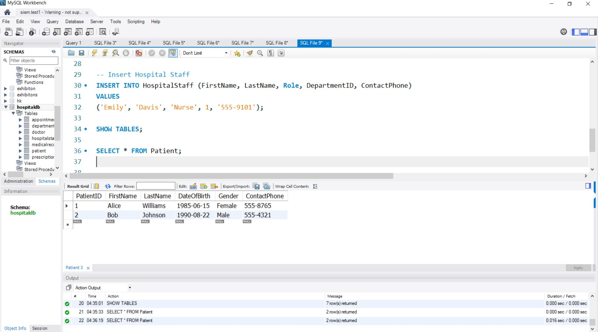

# Medical_db
Patinet_data.JPG

# Hospital Management System

The **Hospital Management System** is a relational database designed to streamline hospital operations such as managing patient records, appointments, prescriptions, medical staff, and more. The database ensures a structured and efficient way to manage healthcare data.

---

## Features

1. **Patient Management**  
   Stores comprehensive information about patients, including personal details and medical records.

2. **Doctor Management**  
   Maintains doctor profiles with specialization, department, and contact information.

3. **Appointments**  
   Tracks patient appointments with assigned doctors and visit reasons.

4. **Medical Records**  
   Keeps a detailed history of diagnoses and treatments for each patient.

5. **Prescriptions**  
   Records medications prescribed by doctors to patients.

6. **Hospital Staff**  
   Stores details about nurses, assistants, and other hospital staff linked to their respective departments.

---

## Database Schema

The schema includes the following tables:
- `Department`: Stores hospital departments (e.g., Cardiology, Neurology).
- `Doctor`: Manages doctors and their specializations.
- `Patient`: Contains patient details like name, date of birth, and contact information.
- `Appointment`: Tracks appointments between patients and doctors.
- `MedicalRecord`: Stores diagnoses and treatments.
- `Prescription`: Tracks prescribed medications.
- `HospitalStaff`: Stores information about nurses and other staff members.

---

## Sample Patient Data

Below is an example of patient data stored in the `Patient` table:



---

## How to Use

1. Clone this repository to your local machine:
   ```bash
   git clone https://github.com/your-repository/hospital-management-system.git

